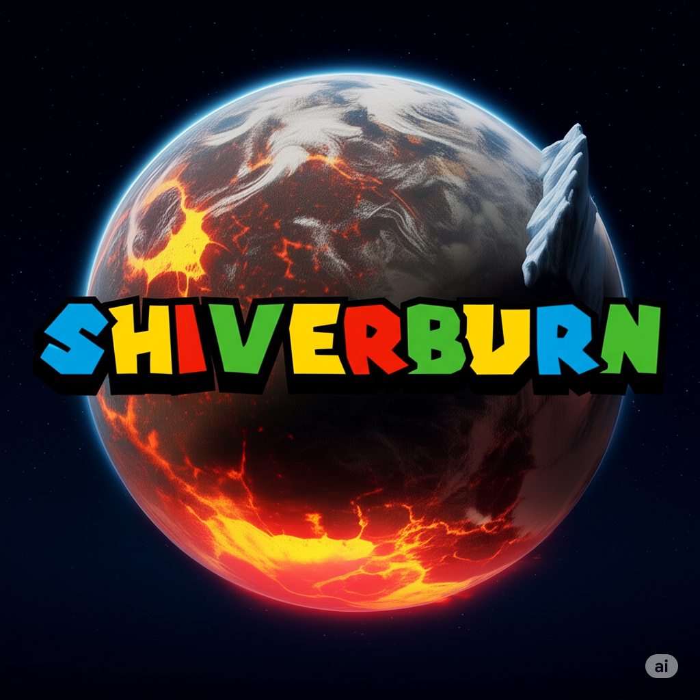

# ShiverBurn

ShiverBurn is a modern, Linux-based (not sure which one at the moment) operating system built around Python apps and an original user experience. It uses the new `.sbapp` and '*.sba*' app format to streamline development and distribution, while offering a bold and intuitive interface inspired by the world of Super Mario Galaxy.

## Key Features

### Custom Luma UI

- **Launch Star**: A start menu with a customizable dock for pinned apps.
- **StarSearch**: A macOS-style system search (Ctrl + Space) for apps, files, and hidden features.
- **Hangar Bay**: A fold-out dock for minimized apps, accessed from the top left.
- **Comet Control**: A quick settings menu, similar to ChromeOS, in the bottom right.
- **Galaxy Center**: A scrollable notification drawer, modeled after Android's notification panel.
- **Comet Observatory**: A full-featured settings app, inspired by macOS System Settings.

### Aesthetic and Interaction

- Centered window titles
- Left-aligned window controls:
  - Red circle with an X for Close
  - Green square-in-square for Maximize
  - Yellow triangle with "-" for Minimize
- Star bit-style mouse cursor with animated trails
- Default system accent colors: pink and blue

### Built for Python Apps

- Apps run natively in Python using the `.shiverburn` format:
  - Includes: `app.py`, `metadata.json`, `icon.png`, optional resources, and README
- Standard `.py` scripts are fully supported without restrictions

### Developer Features and Easter Egg

- Typing `peachespeachespeachespeachespeaches` in StarSearch unlocks a hidden app: **Star 242**
- Star 242 enables:
  - Support for non-system Linux apps
  - Alternate desktop environments (KDE, XFCE, GNOME)
  - Developer system tools (irreversible once activated)

## Developer and User Friendly

- Python-focused development environment
- Simple app discovery and management
- Built-in accessibility: screen reader, magnifier, high contrast mode, text-to-speech
- Clean, distraction-free interaction model

---

ShiverBurn is more than an OS — it's a creative space for developers and a smooth, polished environment for everyday users. Whether building, customizing, or just enjoying the experience, ShiverBurn makes your system feel unique, responsive, and fun.
